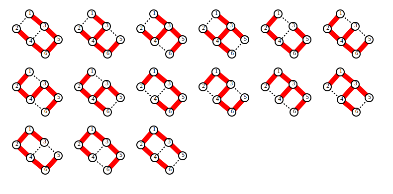

# フロンティア法のためのグラフ描画プログラム

与えられたグラフの部分グラフや部分色付きグラフを列挙した結果を描画。

## 使い方

あらかじめ、部分グラフを列挙しておく。例えば、入力グラフを `example_grid2x3.txt` とすると、
[frontier_basic_tdzdd](https://github.com/junkawahara/frontier_basic_tdzdd) プログラムを用いると、グラフのすべての全域木は以下の通り列挙できる。

```
./program --stree --enum example_grid2x3.txt >subgraphs.txt
```

以下のコマンドで、すべての部分グラフ（上の例の場合は全域木）を、svg 形式で出力する。

```
python draw_subgraphs.py example_grid2x3.txt subgraphs.txt > subgraphs.svg
```

拡張子が .svg のファイル（subgraphs.svg）が生成される。
svg 形式のファイルは web ブラウザ等で開くことができる。



`--reverse` オプションを付けると、部分グラフの辺の順を反転させることができる。

`--black` オプションを付けると、1色目を赤色ではなくて黒色に変更することができる。

## 入力ファイルのフォーマット

入力グラフファイルのフォーマットは [frontier_basic_tdzdd](https://github.com/junkawahara/frontier_basic_tdzdd) と
同様である。

部分グラフ集合のファイルは、1行が1つの部分グラフを表す。
1行には、辺の個数と同じだけの数が書かれている。
前から順に、1番目の辺、2番目の辺、... に対応する。
数が0のときは、対応する辺を使用しないことを意味する。
数が1以上の数のときは、対応する辺を使用することを意味する。
数で色を表す。

## ライセンス

MIT ライセンス
